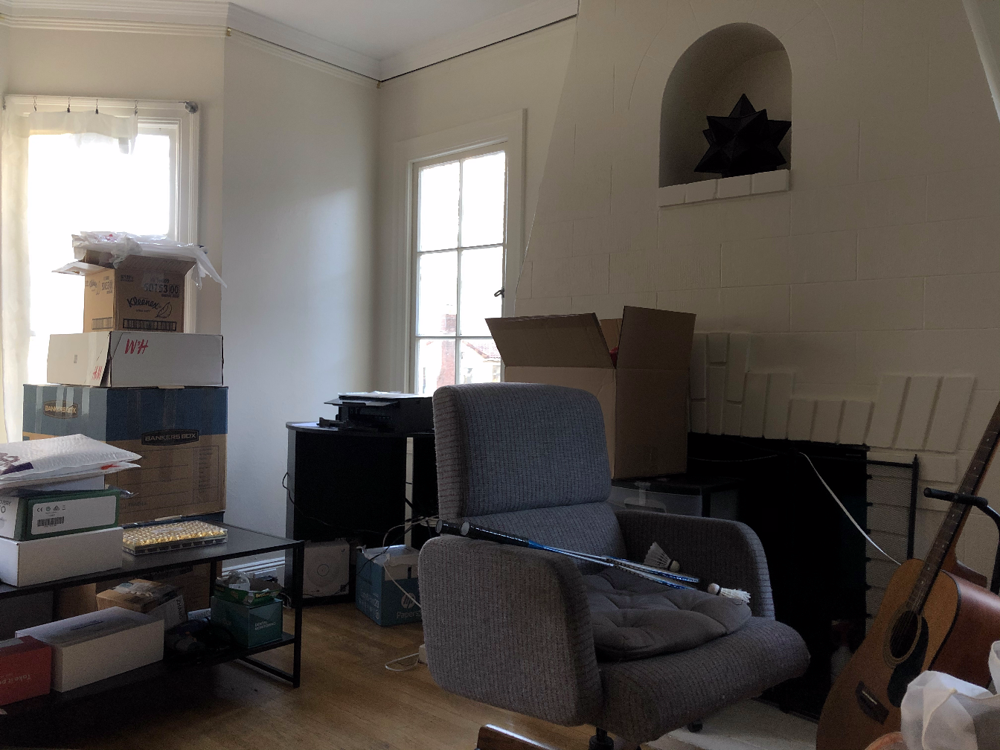

# CS 194-26 Project 5: \[Auto\]Stitching Photo Mosaics

## Project 5A: Image Warping and Mosaicing

### Part A1: Shooting Pictures
For this project, I decided to try and stitch a mosaic of the living room of the house I rent in Berkeley. I took the photos by placing my phone on a tripod and rotating the tripod to 5 different angles. I made sure to use AE/AF lock, although there are still slight lighting differences in the resulting photos.

<table>
  <tr>
    <td>  </td>
    <td>  </td>
    <td>  </td>
    <td>  </td>
    <td>  </td>
  </tr>
</table>

### Part A2: Recovering Homographies

In order to stitch images, we have to be able to compute the homography from one image to another. The math for this is briefly explained in the image below, since Github pages doesn't support LaTeX.

### Part A3: Warping Images

With the homography recovery function implemented, the next step was to try rectifying images. My results are shown below.

<table>
  <tr>
    <td> Before rectification </td>
    <td>  </td>
    <td>  </td>
  </tr>
  <tr>
    <td> After rectification </td>
    <td>  </td>
    <td>  </td>
  </tr>
</table>

We can see the results are pretty good! The cube does look slightly weird, as a normal top-down view centered on the cube wouldn't allow us to see the sides of the cube, but this is normal when applying a homography, as the transformed image is actually imagined from the viewer looking down at a point to the bottom-left of the cube.

### Part A4: Blending Images into a Mosaic

Now that we know our image warping works, we can work on blending images into a mosaic. This was done by first computing the homography matrix from the source image to the destination image. Then, a second homography was computed to transform the images into a third frame in which neither image had any part cut off. The source image would have both the first and second homographies applied to it by composing the two homographies, and the destination image would only have the second homography applied to it. On the sample images 0 and 1, this gave the following results.

<table>
  <tr>
    <td> Before warping </td>
    <td>  </td>
    <td>  </td>
  </tr>
  <tr>
    <td> After warping </td>
    <td>  </td>
    <td>  </td>
  </tr>
</table>

For blending, I did a simple blend of taking half of each image for the overlapping regions. The resulting alpha channels and final results are shown below

This blending worked alright, although there are still clear seams due to slight differences in lighting. However, the images do line up quite well.

Iteratively using this method, I was able to blend all 5 images into a mosaic, shown below.

The result is pretty good, although you can see some blurriness in the center due to our handpicked points being imperfect. However, the next part of the project fixes this problem through automatic matching feature detection!

## Project 5B: Feature Matching for Autostitching

### Part B1: Detecting Corner Features

To detect corner features, we were given a Harris Interest Point Detector to use out of the box. The only thing I changed was the local peaks radius to decrease the number of starting points to some desired amount to reduce computational load. With this, I had the following starting corner features. Note that the edges (20 pixel width) are empty, as we will later extract features using the 40 by 40 square around each corner feature.

The part we actually had to implement was adaptive non-maximal suppression (ANMS), which basically chooses the top-k points based on their maximal suppression radius. As seen below, this method of choosing corner features gives a much better distributed choice of corners than simply choosing the top-k points based on strengths given by the Harris Interest Point Detector.

### Part B2: Extracting Feature Descriptors

Now that we can get candidate features from each image, we need to be able to match features between two different images. We do this by extracting feature descriptors, which are 8-by-8 arrays. These 8-by-8 arrays are just the 40-by-40 window around each feature, downsampled to be 8 by 8, then bias and gain normalized (0 mean, 1 standard deviation).

### Part B3 Matching Feature Descriptors

To match feature descriptors, we simply compare all pairs of feature descriptors between two images, computing their sum-of-squared-distances (SSD) or Nearest-Neighbor (NN) score, where a lower score is better.

We first prune the list of potential matches to be each feature's nearest neighbor. Then, we compute the ratio of the nearest-neighbors score and the next-nearest-neighbor's score. If this ratio is under a certain threshold, we accept that as a valid match. In my testing, I found 0.2 to work just fine, as it was in the paper. This provided the following matching points for my sample images. Each point was given a random color to better visualize matches.

We can see that some of the matches that got through do not actually match, but most are pretty good.

### Part B4: RANSAC

To get rid of the false-positives from matching feature descriptors, we run RANSAC. Basically, we iteratively choose a random set of 4 matches and compute the homography these 4 matches would give. Then, we check how good this homography is for the other matches, and count how many of the other matches this homography is good for. The homography that results in the largest number of good matches is returned. The results after RANSAC can be seen below. We can see that although we did lose some true matches, we retained most and got rid of all the bad matches.

### Part B5: Autostitching Mosaics

Now that we can automatically extract features, match features, and prune false-positives, we can do automatic stitching. Here is the final result, which can be compared with the results from manual point-corrrespondences.

Although auto-stitching did not get rid of the lighting discrepaancies, as that was a problem with my blending method, the blurriness from bad point-correspondences is gone! This is most obvious in the center of the image.

Some more auto-stitches I made can be seen below.

<table>
  <tr>
    <td>  </td>
    <td>  </td>
    <td>  </td>
  </tr>
</table>

<table>
  <tr>
    <td>  </td>
    <td>  </td>
  </tr>
</table>

