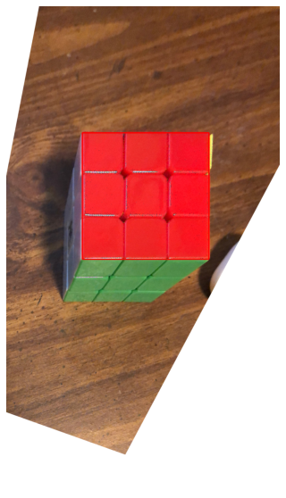

# CS 194-26 Project 5: \[Auto\]Stitching Photo Mosaics

## Project 5A: Image Warping and Mosaicing

### Part A1: Shooting Pictures
For this project, I decided to try and stitch a mosaic of the living room of the house I rent in Berkeley. I took the photos by placing my phone on a tripod and rotating the tripod to 5 different angles. I made sure to use AE/AF lock, although there are still slight lighting differences in the resulting photos.

<table>
  <tr>
    <td>  </td>
    <td>  </td>
    <td>  </td>
    <td>  </td>
    <td>  </td>
  </tr>
</table>

### Part A2: Recovering Homographies

In order to stitch images, we have to be able to compute the homography from one image to another. The math for this is briefly explained in the image below, since Github pages doesn't support LaTeX.

### Part A3: Warping Images

With the homography recovery function implemented, the next step was to try rectifying images. My results are shown below.

<table>
  <tr>
    <td> Before rectification </td>
    <td>  </td>
    <td>  </td>
  </tr>
  <tr>
    <td> After rectification </td>
    <td>  </td>
    <td>  </td>
  </tr>
</table>

We can see the results are pretty good! The cube does look slightly weird, as a normal top-down view centered on the cube wouldn't allow us to see the sides of the cube, but this is normal when applying a homography, as the transformed image is actually imagined from the viewer looking down at a point to the bottom-left of the cube.

### Part A4: Blending Images into a Mosaic

Now that we know our image warping works, we can work on blending images into a mosaic. This was done by first computing the homography matrix from the source image to the destination image. Then, a second homography was computed to transform the images into a third frame in which neither image had any part cut off. The source image would have both the first and second homographies applied to it by composing the two homographies, and the destination image would only have the second homography applied to it. On the sample images 0 and 1, this gave the following results.

<table>
  <tr>
    <td> Before warping </td>
    <td>  </td>
    <td>  </td>
  </tr>
  <tr>
    <td> After warping </td>
    <td>  </td>
    <td>  </td>
  </tr>
</table>

For blending, I did a simple blend of taking half of each image for the overlapping regions. The resulting alpha channels and final results are shown below

This blending worked alright, although there are still clear seams due to slight differences in lighting. However, the images do line up quite well.

Iteratively using this method, I was able to blend all 5 images into a mosaic, shown below.

The result is pretty good, although you can see some blurriness in the center due to our handpicked points being imperfect. However, the next part of the project fixes this problem through automatic matching feature detection!

## Project 5B: Feature Matching for Autostitching

### Part B1: Detecting Corner Features

### Part B2: Extracting Feature Descriptors

### Part B3 Matching Feature Descriptors

### Part B4: RANSAC

### Part B5: Autostitching Mosaics
